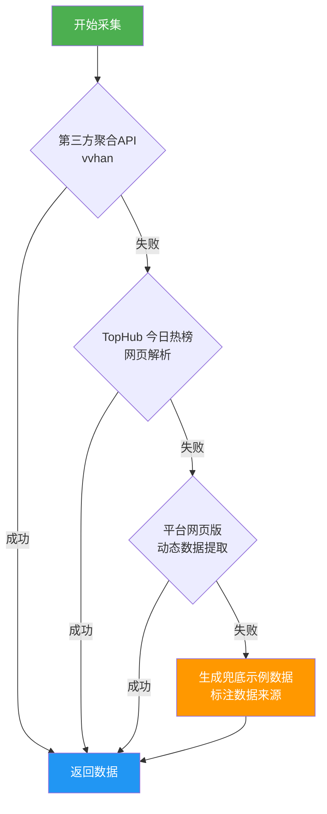

# 📚 热门短视频平台 书单/金句类热榜 Top50 采集工具

> 一键采集抖音、小红书、微信视频号三大平台的书单/金句类热门内容，获取文案、标签、热度等数据并格式化存储。


> 📄 **Skill 元数据**：查看 [skill.md](./skill.md) 了解本 Skill 的结构化描述、接口规范与能力清单。

---

## 📋 目录

- [功能特性](#-功能特性)
- [项目结构](#-项目结构)
- [环境要求](#-环境要求)
- [快速开始](#-快速开始)
- [使用方式](#-使用方式)
  - [命令行模式](#1-命令行模式)
  - [代码调用模式](#2-代码调用模式)
- [输出说明](#-输出说明)
- [数据字段说明](#-数据字段说明)
- [采集策略](#-采集策略)
- [配置说明](#️-配置说明)
- [API 参考](#-api-参考)
- [常见问题](#-常见问题)
- [免责声明](#️-免责声明)

---

## ✨ 功能特性

| 特性 | 说明 |
|:---:|:---|
| 🎯 **多平台支持** | 同时采集抖音、小红书、微信视频号三大平台 |
| 🔄 **多数据源容灾** | 第三方API → TopHub热榜 → 网页爬取 → 兜底示例数据，四级降级策略 |
| 📊 **丰富数据字段** | 标题、热度值、文案内容、标签、作者、点赞数、链接、封面图 |
| 🏷️ **智能内容筛选** | 内置 40+ 书单/金句类关键词，自动识别相关内容 |
| 📁 **多格式输出** | JSON（分平台 + 汇总）+ TXT（人类可读），文件名带时间戳后缀 |
| 🛡️ **反爬策略** | 随机 User-Agent、请求间隔、自动重试机制 |
| 🔧 **灵活配置** | 支持命令行参数、环境变量、代码调用多种使用方式 |

---

## 📁 项目结构

```
hot_book_quotes_ranking/
├── __init__.py          # 包初始化，导出 HotRankingCollector 主类
├── main.py              # 命令行入口脚本
├── collector.py         # 主采集器（统一调度、筛选、保存）
├── crawlers.py          # 各平台数据采集器（抖音 / 小红书 / 微信视频号）
├── config.py            # 全局配置（API地址、关键词、请求参数等）
├── utils.py             # 工具函数（HTTP请求、文件存储、标签提取等）
├── requirements.txt     # Python 依赖列表
├── skill.md             # Skill 元数据描述文件
├── README.md            # 项目说明文档
└── output/              # 数据输出目录（自动创建）
    ├── 抖音_书单金句热榜_YYYYMMDDHH.json
    ├── 小红书_书单金句热榜_YYYYMMDDHH.json
    ├── 微信视频号_书单金句热榜_YYYYMMDDHH.json
    ├── 全平台_书单金句热榜_YYYYMMDDHH.json
    └── 全平台_书单金句热榜_YYYYMMDDHH.txt
```

---

## 🔧 环境要求

- **Python** >= 3.7
- **操作系统**：Linux / macOS / Windows
- **网络**：需要能访问外部 API（无网络时自动降级使用兜底数据）

### 依赖包

| 包名 | 版本 | 用途 |
|:---|:---|:---|
| `requests` | >= 2.28.0 | HTTP 请求 |
| `beautifulsoup4` | >= 4.12.0 | HTML 页面解析 |
| `lxml` | >= 4.9.0 | 高性能 XML/HTML 解析引擎 |
| `fake-useragent` | >= 1.4.0 | 随机 User-Agent 生成 |

---

## 🚀 快速开始

### 1. 安装依赖

```bash
cd hot_book_quotes_ranking
pip install -r requirements.txt
```

### 2. 一键运行

```bash
# 进入 skills 目录
cd /path/to/skills

# 运行采集（默认采集三大平台 Top50）
python3 -m hot_book_quotes_ranking.main
```

### 3. 查看结果

采集完成后，数据自动保存至 `output/` 目录：

```
output/
├── 抖音_书单金句热榜_2026031611.json          # 抖音单独数据
├── 小红书_书单金句热榜_2026031611.json        # 小红书单独数据
├── 微信视频号_书单金句热榜_2026031611.json    # 微信视频号单独数据
├── 全平台_书单金句热榜_2026031611.json        # 三平台汇总 JSON
└── 全平台_书单金句热榜_2026031611.txt         # 三平台汇总 TXT（人类可读）
```

---

## 📖 使用方式

### 1. 命令行模式

```bash
# 基础用法：采集所有平台 Top50
python3 -m hot_book_quotes_ranking.main

# 只保留书单/金句类内容（通过关键词筛选）
python3 -m hot_book_quotes_ranking.main --filter

# 指定输出目录
python3 -m hot_book_quotes_ranking.main --output ./mydata

# 每个平台只获取前 20 条
python3 -m hot_book_quotes_ranking.main --top 20

# 显示详细调试日志
python3 -m hot_book_quotes_ranking.main -v

# 组合使用
python3 -m hot_book_quotes_ranking.main --filter --top 30 --output ./data -v
```

**命令行参数一览：**

| 参数 | 简写 | 类型 | 默认值 | 说明 |
|:---|:---|:---|:---|:---|
| `--filter` | - | flag | `False` | 只保留书单/金句类相关内容 |
| `--output` | `-o` | string | `./output` | 指定输出目录路径 |
| `--top` | `-n` | int | `50` | 每个平台获取的数量上限 |
| `--verbose` | `-v` | flag | `False` | 显示详细日志 |

### 2. 代码调用模式

#### 基本用法

```python
from hot_book_quotes_ranking import HotRankingCollector

# 创建采集器
collector = HotRankingCollector()

# 一键运行：采集 → 保存
saved_files = collector.run()

# 打印摘要
print(collector.get_summary())
```

#### 自定义参数

```python
collector = HotRankingCollector(
    output_dir="./my_output",  # 自定义输出目录
    top_n=30,                  # 每平台取前30条
)

# 运行并筛选书单/金句类内容
saved_files = collector.run(filter_only_book_quotes=True)
```

#### 单独采集某个平台

```python
collector = HotRankingCollector()

# 只采集抖音
douyin_data = collector.collect_douyin()

# 只采集小红书
xhs_data = collector.collect_xiaohongshu()

# 只采集微信视频号
weixin_data = collector.collect_weixin_video()

# 手动保存
saved_files = collector.save_results()
```

#### 高级：获取筛选后的书单/金句数据

```python
collector = HotRankingCollector()
collector.collect_all()

# 从全量数据中筛选书单/金句类内容
filtered = collector.filter_book_quote_items()
for platform, items in filtered.items():
    print(f"[{platform}] 书单/金句类内容: {len(items)} 条")
    for item in items:
        print(f"  - {item['title']}  标签: {item['tags']}")
```

---

## 📤 输出说明

### 文件命名规则

```
{平台名}_书单金句热榜_{时间戳}.json
```

- **时间戳格式**：`YYYYMMDDHH`（年月日时），如 `2026031611` 表示 2026年3月16日11时

### JSON 输出格式

**单平台 JSON：**

```json
{
  "platform": "抖音",
  "crawl_time": "2026-03-16 11:13:37",
  "total_count": 50,
  "items": [
    {
      "rank": 1,
      "title": "人生就是一场修行#书单推荐",
      "hot_value": "1000w",
      "content": "视频文案内容...",
      "tags": ["书单推荐", "书单"],
      "author": "作者名称",
      "likes": "100w",
      "url": "https://...",
      "cover": "https://...",
      "source": "抖音-第三方API",
      "is_book_quote": true
    }
  ]
}
```

**全平台汇总 JSON：**

```json
{
  "crawl_time": "2026-03-16 11:13:37",
  "total_count": 150,
  "platforms": {
    "抖音": { "count": 50, "items": [...] },
    "小红书": { "count": 50, "items": [...] },
    "微信视频号": { "count": 50, "items": [...] }
  }
}
```

### TXT 输出效果

```
================================================================================
  热门短视频平台 书单/金句类热榜 Top50
  采集时间: 2026-03-16 11:13:37
================================================================================

────────────────────────────────────────────────────────────────────────────────
  【抖音】 共 50 条
────────────────────────────────────────────────────────────────────────────────

  1. 人生就是一场修行#书单推荐
     🔥 热度: 1000w
     📝 文案: 人生就是一场修行，我们都在修自己...
     🏷️  标签: 书单推荐, 书单
     👤 作者: xxx
     ❤️  点赞: 100w
     🔗 链接: https://...
```

---

## 📊 数据字段说明

每条热榜数据包含以下字段：

| 字段 | 类型 | 说明 |
|:---|:---|:---|
| `rank` | `int` | 排名序号 |
| `title` | `str` | 热榜标题 |
| `hot_value` | `str` | 热度值（如"1000w"） |
| `content` | `str` | 文案/描述内容 |
| `tags` | `list[str]` | 相关标签列表（自动提取） |
| `author` | `str` | 作者/发布者名称 |
| `likes` | `str` | 点赞数 |
| `url` | `str` | 原始链接 |
| `cover` | `str` | 封面图片 URL |
| `source` | `str` | 数据来源标识（如"抖音-第三方API"） |
| `is_book_quote` | `bool` | 是否为书单/金句类内容 |

---

## 🔄 采集策略

本工具针对每个平台采用**多级降级容灾策略**，确保在不同网络环境下都能获取数据：



**各层级说明：**

| 优先级 | 数据源 | 说明 |
|:---:|:---|:---|
| 1️⃣ | 第三方聚合 API（vvhan 等） | 速度快、格式统一，无需 Cookie |
| 2️⃣ | TopHub 今日热榜 | 网页解析方式获取，数据覆盖面广 |
| 3️⃣ | 平台网页版 | 直接访问平台页面，尝试提取动态数据 |
| 4️⃣ | 兜底示例数据 | 所有方式失败时生成，明确标注为示例数据 |

### 反爬机制

- 🎭 **随机 User-Agent**：每次请求随机切换浏览器标识
- ⏱️ **请求间隔**：平台间采集自动间隔 1~2 秒
- 🔁 **自动重试**：请求失败自动重试 3 次，间隔递增
- 🔒 **SSL 容错**：自动处理 SSL 证书验证问题

---

## ⚙️ 配置说明

### 环境变量

如需登录态以获取更完整的数据，可通过环境变量配置各平台 Cookie：

```bash
# 抖音 Cookie
export DOUYIN_COOKIE="your_douyin_cookie_here"

# 小红书 Cookie
export XHS_COOKIE="your_xiaohongshu_cookie_here"

# 微信视频号 Cookie
export WEIXIN_VIDEO_COOKIE="your_weixin_video_cookie_here"
```

### 核心配置参数（config.py）

| 配置项 | 默认值 | 说明 |
|:---|:---|:---|
| `REQUEST_TIMEOUT` | `15` | HTTP 请求超时时间（秒） |
| `RETRY_TIMES` | `3` | 请求失败重试次数 |
| `REQUEST_INTERVAL` | `1.5` | 请求间隔时间（秒） |
| `TOP_N` | `50` | 每平台获取数量上限 |
| `OUTPUT_DIR` | `./output` | 默认输出目录 |
| `BOOK_QUOTE_KEYWORDS` | 40+ 关键词列表 | 书单/金句类内容识别关键词 |

### 自定义关键词

在 `config.py` 中修改 `BOOK_QUOTE_KEYWORDS` 列表，可自定义书单/金句类内容的识别关键词：

```python
BOOK_QUOTE_KEYWORDS = [
    "书单", "金句", "名言", "语录", "文案", "治愈", "扎心",
    "人生感悟", "励志", "读书", "好书推荐", "经典语句",
    # 添加你的自定义关键词...
    "你的关键词1", "你的关键词2",
]
```

---

## 📚 API 参考

### HotRankingCollector

主采集器类，提供统一的采集、筛选、保存接口。

```python
class HotRankingCollector(output_dir=None, top_n=50)
```

**构造参数：**

| 参数 | 类型 | 默认值 | 说明 |
|:---|:---|:---|:---|
| `output_dir` | `str \| None` | `None` | 输出目录，默认为项目下 `output/` |
| `top_n` | `int` | `50` | 每平台获取数量上限 |

**方法列表：**

| 方法 | 返回值 | 说明 |
|:---|:---|:---|
| `run(filter_only_book_quotes=False)` | `Dict[str, str]` | 一键运行：采集 → 筛选 → 保存，返回文件路径字典 |
| `collect_all()` | `Dict[str, List]` | 采集所有平台数据 |
| `collect_douyin()` | `List[Dict]` | 单独采集抖音 |
| `collect_xiaohongshu()` | `List[Dict]` | 单独采集小红书 |
| `collect_weixin_video()` | `List[Dict]` | 单独采集微信视频号 |
| `save_results()` | `Dict[str, str]` | 保存采集结果到文件 |
| `filter_book_quote_items()` | `Dict[str, List]` | 筛选书单/金句类内容 |
| `get_summary()` | `str` | 获取采集结果文字摘要 |

---

## ❓ 常见问题

### Q: 采集结果显示为"示例数据"？

**A:** 这说明所有网络数据源都无法访问。可能原因：

1. 当前网络环境无法访问外部 API（如内网、代理限制等）
2. 第三方 API 服务暂时不可用
3. 平台接口发生变更

**解决方案**：确保网络可正常访问外网，或配置平台 Cookie 获取更多数据源。

### Q: 如何增加新的数据源？

**A:** 在 `crawlers.py` 对应的 Crawler 类中新增采集方法，并在 `fetch_hot_list()` 中按优先级添加调用即可。

### Q: 数据更新频率如何？

**A:** 热榜数据实时变化，每次运行都会获取最新数据。建议通过 cron 定时任务定期采集：

```bash
# 每小时采集一次
0 * * * * cd /path/to/skills && python3 -m hot_book_quotes_ranking.main
```

### Q: 文件名时间戳是什么格式？

**A:** 格式为 `YYYYMMDDHH`（年月日时），例如 `2026031611` 代表 2026年3月16日11时。每小时运行会生成独立文件，不会覆盖。

---

## ⚠️ 免责声明

1. 本工具仅供**学习交流**使用，请遵守各平台的服务条款和相关法律法规。
2. 采集的数据来源于公开渠道（第三方聚合 API、公开网页），不涉及用户隐私数据。
3. 请合理控制采集频率，避免对目标平台造成压力。
4. 使用本工具所产生的一切后果由使用者自行承担。

---

## 📄 License

MIT License
